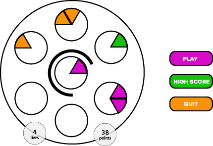

# Javascript Project Proposal: Iconfactory's FRENZIC
***
### Background
Iconfactory's Frenzic is a high pressure puzzle game that pits you against time. A player is challenged to fill 5 different empty circles with randomly colored pie-wedges before their time runs out.

Each circle is cleared and points are scored when a circle has been entirely filled with a successful collection of wedges (6 pie-slices each).  

Circles filled with all like-colored wedges score more points.  

The timer gradually accelerates as the game progresses.  A player loses a life if the timer runs out before successfully placing the current wedge.

### Funtionality & MVP
With this Frenzic clone, users will be able to:
- [ ] start, pause, and restart the game.
- [ ] select and place the active pie-wedges into a fitting circle.
- [ ] clear circles containing a full (6) collection of pie-wedges.
- [ ] accrue points for cleared pies and additional points for clearing pies of the same color.
- [ ] store their initials and highscores into the highscore library.

### Wireframes

This app will be a single screen with the game "board" hosting all of the in-game controls.  Nav buttons to the apps github repo, my personal LinkedIn and an about me modal will be built into a header component above the main game board container.  To the right of the game board (possibly in the header along with the other links) will be the initialization controls to start the game and access the highscore library.

### Architecture and Technologies

• Javascript    
• Webpack   
• HTML5   
• CSS    

#### File / component structure:

board.js: will render all of the static components as well render all of the logical components (pies(6), center_pie, score_component, lives_left_component, pie-wedges, timer_ring)

pies.js will handle all of the logic for each pie-container.
center.js will handle all of the logic for generating the random pie-wedges.
score.js will handle all of the logic for keeping track of the score.
lives.js will handle all of the logic for keeping track of the length of the game and the "game-over" functionality.
timer.js will handle the timer logic and the gradual decrement of time over the length of a game-session.

### Implementation Timeline

#### Day 1:   
  • Entry File 
  • Static Board (Adobe Illustrator) 
  • Pie Wedge Graphic 
  • Working Webpack 
  • Learn enough vanilla javascript / css / html5 to get a wedge rendering inside of a pie-slot. 
  • Build out JS timer logic and progression (x points == y% time decrease) 
  • render timer animation (x amount of seconds = each cell of timer circle to become visible) 
  
#### Day 2:
  • Working center pie (random wedges) logic. 
  • Pie container working and able to receive pie wedges, account for total wedges / wedge-position filled and clear when all positons have been taken.  Disallows invalid wedge-positions to be taken. 
  • Click (pies) event handling 

  
#### Day 3:
  • Score component tracks points for completed pies and (more) points for completed pies of the same color. 
  • Lives component tracks lives remaining and initiates a game-over sequence when the lives counter hits 0. 
  
#### Day 4: 
  • Enhance graphic styling (pie wedges, css) 
  • Build highscore DB and frontend 
  
### Bonus Features:

- [ ] sound effects.
- [ ] animated actions: pie clear, wedge placement.
- [ ] bonus elements: 2X score token, time-slow token, clear-all-pies token.

